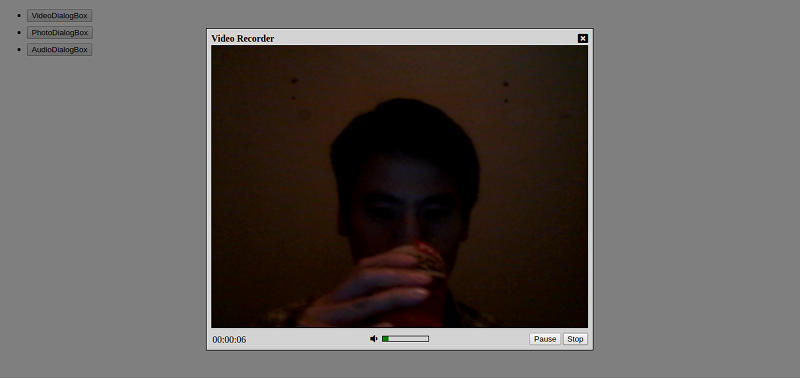

Relaks Media Capture Example
============================

In [previous examples](https://github.com/trambarhq/relaks#examples), we used [Relaks](https://github.com/trambarhq/relaks) to facilitate retrieval of remote data. In this example we're going to do something different. We're going to build a component that captures video through a webcam. It's meant to demonstrate that Relaks can be used to solve a broad range of problems. It'll also yield a reusable library that we can employ in future projects.

One way to think of Relaks is that it's React with time added. Where as `render()` produces a picture, `renderAsync()` produces an animation, composed of multiple pictures appearing at different points in time. When we use Relaks to render a page progressively, we're actually creating an animation that looks as follows:

* Frame 1: Message indicating the page is loading
* Frame 2: Page with 60% of the data it needs
* Frame 3: Page with 85% of the data
* Frame 4: Page with 100% of the data

For our video capturing component, we'd create something like this:

* Frame 1: Placeholder graphic while wanting for the user to grant permission to camera
* Frame 2: Input from camera 1
* Frame 3: Input from camera 2 (after the user made the switch)
* Frame 4: Changes to the UI indicating recording has commenced (after the user pressed the **Start** button)
* Frame 5: Duration changes to `00:01`
* Frame 6: Duration changes to `00:02`
*  ...
* Frame 64: Duration changes to `01:00`
* Frame 65: The recorded video (after the user pressed the **Stop** button)

This animation runs for a bit longer, naturally. It's also non-linear. The user can change how it unfolds. Conceptually though, it's not at all different from what we've been creating so far. We're going to employ the same strategy as before: create a regular React component that handles the visual aspects and a Relaks component that handles with the temporal aspects.

Meanwhile, the details concerning with camera management and video encoding will get shoved into a [separate reusable class](https://github.com/trambarhq/relaks-media-capture).

## Live Demo

You can see the example in action [here](https://trambar.io/examples/media-capture/). It's little more than a list of buttons. The first seven brings up the synchronous component in various state, with video files as stand-in for camera input. The last button brings up the asynchronous component, wired up to a real camera.

## Getting Started

To see the code running in debug mode, first clone this repository. In the working folder, run `npm install`. Once that's done, run `npm run start` to launch [WebPack Dev Server](https://webpack.js.org/configuration/dev-server/). Open a browser window and enter `http://localhost:8080` as the location.

Run `npm run start-https` if you wish to see the example in a different device. Either Chrome or Firefox permit the use of the camera in an insecure page (unless the server is localhost). Therefore WebPack Dev Server needs to employ HTTPS. The browser will still regard the page as suspect. You'll need to confirm that you really want to go there.

## VideoDialogBoxAsync

## VideoDialogBox
